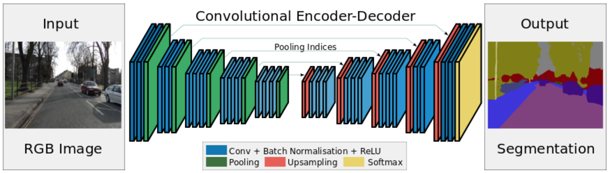
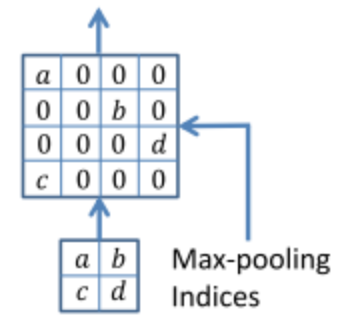
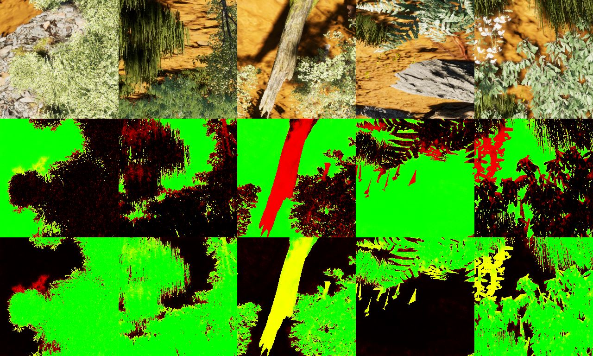

# SegNet

SegNet is a model of semantic segmentation based on Fully Convolutional Network.

This repository contains the implementation of learning and testing in keras and tensorflow.
Also included is a custom layer implementation of index pooling, a new property of segnet.

## Architecture
- encoder decoder architecture
- fully convolutional network
- indices pooling

    

## Description
This repository is SegNet architecture for Semantic Segmentation.
The repository of other people's segmentation, pooling with indices not implemented.
But In this repository we implemented  pooling layer and unpooling layer with indices at MyLayers.py.
Segnet architecture is early Semantic Segmentation model,so acccuracy is low but fast.

## Domain adaptation
This network included a domain adaptation branch (DANN).
It is used as a regulator to penalize training domain exclusive features.
Accuracy of this branch should stay at 0.5 (impossible to use feature extraction to predict image origin dataset).

## Fork (JeffOnGithub)
This repository is used for my master.
I've cleaned up / updated some stuff / adapted it for what i'm working on.
Feel free to use those changes.

## Usage
- train.py launches training
- eval.py launches evaluation
- The configuration.py file contains all parameters for training and evaluation.
- You can overwrite any of these parameters via the command line (see train.py and eval.py for command line parameters).

## Results

